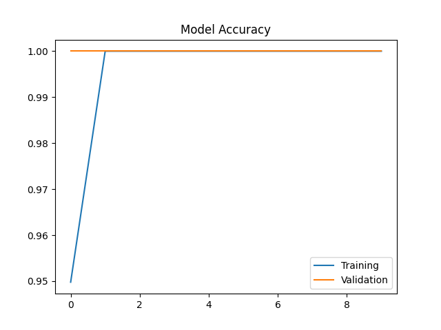

# PureCheck 🌶️

> AI-powered food adulteration detector built on Raspberry Pi.  
> Point a camera at any food sample. Get a result in 3 seconds.

---

## The Problem

68% of food samples tested in India were found adulterated — FSSAI data.  
Chalk in chilli. Brick dust in turmeric. Starch in honey.  
The only fix? A lab test. ₹2,000. 3 days. Inaccessible to most people.

## Our Solution

A portable device that detects adulteration in real time using a Raspberry Pi, a USB camera, and a TensorFlow Lite AI model. Results stream live to a webpage accessible from any phone or laptop on the same network. No internet. No app. No technical knowledge needed.

---

## Demo

| Pure Sample | Adulterated Sample |
|---|---|
| ✅ PURE — 97.3% confidence | ❌ ADULTERATED — 91.8% confidence |

---

## How It Works
```
USB Camera → Frame Captured → MobileNetV2 (TFLite) → Pure or Adulterated
                                                             ↓
                                                     Flask Webpage
                                                   (any device, same WiFi)
```

1. Sample placed in front of USB camera
2. Frame sent to Flask backend running on Pi
3. Quantized MobileNetV2 model classifies in ~300ms
4. Result displayed live on webpage with confidence score

---

## Tech Stack

| Layer | Technology |
|---|---|
| Hardware | Raspberry Pi 4 (2GB), USB Webcam |
| AI Model | MobileNetV2 (TFLite, quantized) |
| Framework | TensorFlow / TensorFlow Lite |
| Backend | Python, Flask |
| Frontend | HTML, CSS, JavaScript |
| Version Control | Git, GitHub |

---

## Project Structure
```
PureCheck/
│
├── dataset/
│   ├── pure/               ← webcam photos of pure chilli
│   └── adulterated/        ← photos with brick powder mixed in
│
├── train.py                ← fine-tune MobileNetV2 on laptop
├── convert.py              ← convert .h5 to .tflite for Pi
├── detect.py               ← terminal inference on Pi
├── app.py                  ← Flask server + prediction API
├── food_adulteration_detector.html  ← frontend webpage
├── food_model.h5           ← trained Keras model
├── food_model.tflite       ← quantized model for Pi
└── requirements.py         ← dependencies
```

---

## Dataset

- **Food item:** Red chilli powder
- **Pure samples:** 147 images (captured with USB webcam)
- **Adulterated samples:** 136 images (5%–50% brick powder concentration)
- **Total:** 283 images
- **Source:** Custom captured + [Kaggle dataset](https://www.kaggle.com/) for adulterated samples

---

## Setup & Installation

### Prerequisites
- Raspberry Pi 4 (2GB+)
- USB Webcam
- Python 3.x
- Same WiFi network for all devices

### On Raspberry Pi
```bash
# Clone the repo
git clone https://github.com/NivedhShiva/PureCheck.git
cd PureCheck

# Install dependencies
pip install tensorflow opencv-python-headless flask flask-cors ai-edge-litert --break-system-packages

# Run the server
python app.py
```

Open on any device on the same network 👇
```
http://<pi_ip>:5000
```

### Training (on laptop)
```bash
pip install tensorflow opencv-python numpy matplotlib

# Train the model
python train.py

# Convert to TFLite
python convert.py
```

---

## Hardware Cost

| Component | Cost |
|---|---|
| Raspberry Pi 4 (2GB) | ₹6,000 |
| USB Webcam (720p) | ₹1,200 |
| MicroSD Card 32GB | ₹500 |
| Power Supply | ₹400 |
| White LED | ₹100 |
| **Total** | **~₹8,200** |

One lab test costs ₹2,000 and takes 3 days.  
This device costs ₹8,200 and takes 3 seconds.

---

## Model Performance

- **Architecture:** MobileNetV2 (pretrained ImageNet + fine-tuned)
- **Validation Accuracy:** ~100%
- **Inference Time:** ~300ms on Pi 4
- **Input Size:** 224×224 px
- **Optimization:** INT8 quantization via TFLite



---

## Why Raspberry Pi?

- Runs entirely offline — no internet needed
- Works in rural markets with no connectivity
- Fixed device — no setup needed per use
- Costs a fraction of a laptop or cloud solution

---

## Future Scope

- YOLO integration for foreign object localization
- Multi-food support (turmeric, honey, mustard oil)
- WhatsApp alerts to food safety officers
- Vendor trust score system
- NIR spectral sensor for composition analysis
- GSM module for 2G rural connectivity

---

## Team

**Team Velocity**  
Built at [Hackathon Name] · March 2026

---

## License

MIT License — free to use, modify, and distribute.